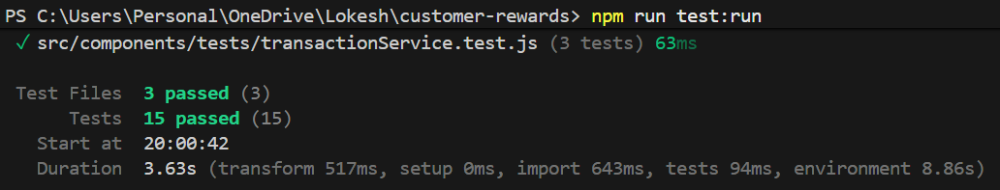
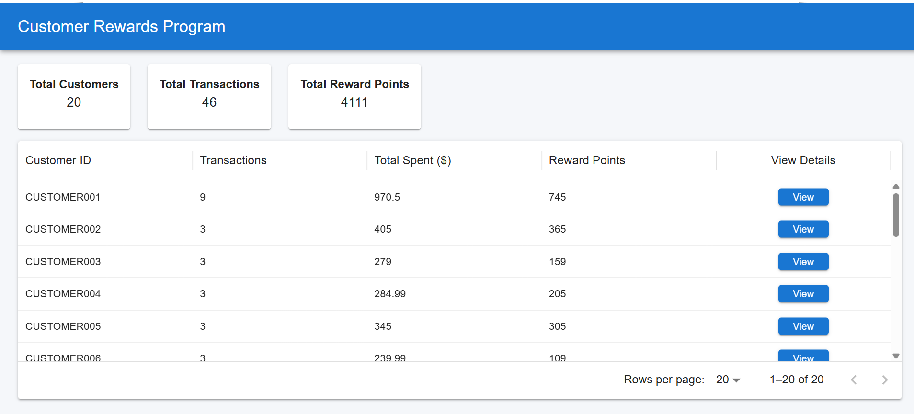
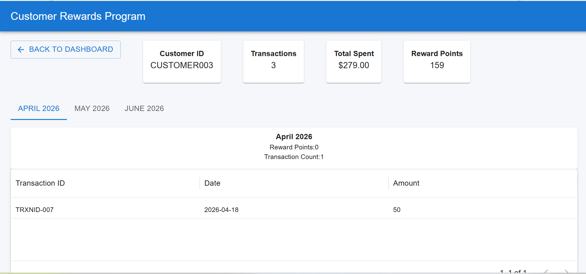

# Customer Rewards Dashboard

A React JS application to calculate and display customer reward points based on transaction history.

## Overview

This project calculates reward points for customers using a local JSON mock dataset. It simulates an API call, displays customer-level reward summaries, and provides a customer detail page with monthly reward details and transaction-level reward points.

## Reward Calculation Rule

Customers earn reward points as follows:

* 2 points for every dollar spent over `$100`
* 1 point for every dollar spent between `$50` and `$100`
* No points for amounts `$50` or below

Example:

```text
Amount = $120

Points between $50 and $100 = 50 x 1 = 50
Points above $100 = 20 x 2 = 40

Total Reward Points = 90
```

## Tech Stack

* React JS
* JavaScript
* Vite
* Material UI
* MUI DataGrid
* React Router
* PropTypes
* Vitest
* Local JSON mock data
* Custom logger using `console.info` and `console.error`

## Features

* Dashboard page with customer summary cards
* Customer table using MUI DataGrid
* View button for customer drill-down
* Customer details page
* Monthly reward tabs
* Monthly reward cards
* Transaction table with reward points
* Loading state
* Error handling
* Local mock API simulation
* Custom logging
* Unit test cases
* PropTypes validation
* Simple CSS styling

## Project Setup

Install dependencies:

```bash
npm install
```

Run the project locally:

```bash
npm run dev
```

Open the application in browser:

```text
http://localhost:5173
```

Build the project:

```bash
npm run build
```

## Run Test Cases

Run all test cases:

npm run test:run

Run tests in each file like example:

npx vitest run src/tests/rewardCalculator.test.js

## Required Scripts

Make sure `package.json` contains:

```json
{
  "scripts": {
    "dev": "vite",
    "build": "vite build",
    "lint": "eslint .",
    "preview": "vite preview",
    "test": "vitest",
    "test:run": "vitest run"
  }
}
```

## Mock Data

Transaction data is stored in:

```text
public/data/transaction.json
```

The API call is simulated from:

```text
src/api/customerApi.jsx
```

## Folder Structure

```text
src
│
├── api
│   └── customerApi.jsx
│
├── assets
│   ├── hero.png
│   ├── react.svg
│   └── vite.svg
│
├── components
│   │
│   ├── common
│   │   ├── AppLoader.jsx
│   │   ├── AppPagination.jsx
│   │   ├── EmptyState.jsx
│   │   └── ErrorState.jsx
│   │
│   ├── constants
│   │   ├── appConstants.js
│   │   ├── dashboardConstants.js
│   │   ├── rewardConstants.js
│   │   ├── routeConstants.js
│   │   └── tableConstants.js
│   │
│   ├── context
│   │   └── CustomerContext.jsx
│   │
│   ├── customer
│   │   ├── CustomerSummary.jsx
│   │   ├── MonthlyRewardTabs.jsx
│   │   ├── MonthlyRewardsCard.jsx
│   │   └── TransactionTable.jsx
│   │
│   ├── dashboard
│   │   ├── CustomerTable.jsx
│   │   └── DashboardSummaryCards.jsx
│   │
│   ├── hooks
│   │   ├── useCustomers.js
│   │   ├── useDebounce.js
│   │   ├── usePagination.js
│   │   └── useRewards.js
│   │
│   ├── layouts
│   │   └── MainLayout.jsx
│   │
│   ├── logger
│   │   └── logger.jsx
│   │
│   ├── pages
│   │   ├── CustomerDetailsPage.jsx
│   │   ├── DashboardPage.jsx
│   │   └── NotFoundPage.jsx
│   │
│   ├── propTypes
│   │   ├── customerPropTypes.js
│   │   └── transactionPropTypes.js
│   │
│   ├── routes
│   │   └── AppRoutes.jsx
│   │
│   ├── services
│   │   ├── customerService.js
│   │   ├── dashboardService.js
│   │   ├── rewardCalculatorService.js
│   │   └── transactionService.js
│   │
│   ├── styles
│   │   ├── global.css
│   │   └── theme.js
│   │
│   ├── tests
│   │   ├── customerService.test.js
│   │   ├── rewardCalculator.test.js
│   │   └── transactionService.test.js
│   │
│   └── utils
│       ├── customerUtils.js
│       ├── dateUtils.js
│       ├── rewardUtils.js
│       └── transactionUtils.js
│
├── App.jsx
├── App.css
├── index.css
└── main.jsx
```

## Main Pages

### Dashboard Page

File:

```text
src/components/pages/DashboardPage.jsx
```

Responsibilities:

* Fetch transaction data using `useCustomers`
* Show loading state
* Show error state
* Build customer dashboard data
* Render dashboard summary cards
* Render customer table

### Customer Details Page

File:

```text
src/components/pages/CustomerDetailsPage.jsx
```

Responsibilities:

* Read `customerId` from route parameter
* Fetch transactions
* Find selected customer
* Display customer summary
* Display monthly reward tabs
* Display transaction table

## Component Details

### MainLayout

File:

```text
src/components/layouts/MainLayout.jsx
```

Provides the common application layout including:

* App bar
* Page container
* Common spacing

### DashboardSummaryCards

File:

```text
src/components/dashboard/DashboardSummaryCards.jsx
```

Displays overall dashboard metrics:

* Total customers
* Total transactions
* Total reward points

### CustomerTable

File:

```text
src/components/dashboard/CustomerTable.jsx
```

Displays all customers in a Material UI DataGrid.

Features:

* Customer ID
* Transaction count
* Total spent
* Total reward points
* View button
* Pagination
* Row click navigation
* Customer selection logging

### CustomerSummary

File:

```text
src/components/customer/CustomerSummary.jsx
```

Displays customer-level details:

* Customer ID
* Transaction count
* Total spent
* Total reward points

### MonthlyRewardTabs

File:

```text
src/components/customer/MonthlyRewardTabs.jsx
```

Displays monthly tabs for the selected customer's transaction months.

Each tab represents one month and shows monthly reward details.

### MonthlyRewardsCard

File:

```text
src/components/customer/MonthlyRewardsCard.jsx
```

Displays monthly reward summary:

* Month
* Reward points
* Transaction count

### TransactionTable

File:

```text
src/components/customer/TransactionTable.jsx
```

Displays transaction-level details:

* Transaction ID
* Date
* Amount
* Reward points

### AppLoader

File:

```text
src/components/common/AppLoader.jsx
```

Reusable loading component shown during mock API fetch.

### ErrorState

File:

```text
src/components/common/ErrorState.jsx
```

Reusable error component with retry action.

### EmptyState

File:

```text
src/components/common/EmptyState.jsx
```

Reusable empty state component for missing data.

## Services

### customerService.js

File:

```text
src/components/services/customerService.js
```

Handles customer-related business logic:

* Build customer summary
* Get customer by ID
* Search customer data if required

### dashboardService.js

File:

```text
src/components/services/dashboardService.js
```

Calculates dashboard summary metrics.

### rewardCalculatorService.js

File:

```text
src/components/services/rewardCalculatorService.js
```

Handles reward-related operations:

* Transaction reward calculation
* Customer total rewards
* Transactions with reward points
* Monthly reward totals

### transactionService.js

File:

```text
src/components/services/transactionService.js
```

Handles transaction-related operations:

* Group transactions by month
* Get recent month transactions
* Filter transactions by selected month
* Sort transactions

## Utils

### rewardUtils.js

File:

```text
src/components/utils/rewardUtils.js
```

Contains the core reward calculation logic.

### customerUtils.js

File:

```text
src/components/utils/customerUtils.js
```

Contains helper functions to group and summarize customer transactions.

### transactionUtils.js

File:

```text
src/components/utils/transactionUtils.js
```

Contains helper functions for month-wise transaction grouping and reward totals.

### dateUtils.js

File:

```text
src/components/utils/dateUtils.js
```

Contains reusable date helper methods.

## API Simulation

The project does not use a backend or separate API repository.

The app fetches local JSON data from:

```text
/data/transaction.json
```

The simulated API call includes:

* Artificial delay
* Loading state
* Error handling
* API request logging
* API success logging
* API failure logging

## Logging

Logger file:

```text
src/components/logger/logger.jsx
```

Logging is implemented using:

```javascript
console.info()
console.error()
```

Logger is used for:

* API request start
* API request success
* API request failure
* Customer selection
* Reward calculation

## Routing

Routing file:

```text
src/components/routes/AppRoutes.jsx
```

Routes:

```text
/                      Dashboard page
/customer/:customerId  Customer details page
*                      Not found page
```

Customer route is generated using:

```text
buildCustomerRoute(customerId)
```

## PropTypes

PropTypes are maintained in:

```text
src/components/propTypes/customerPropTypes.js
src/components/propTypes/transactionPropTypes.js
```

PropTypes are used to validate component props and improve maintainability.

## Test Coverage

Test files:

```text
src/components/tests/rewardCalculator.test.js
src/components/tests/customerService.test.js
src/components/tests/transactionService.test.js
```

Test cases cover:

* Positive reward calculation
* Negative reward calculation
* Zero amount
* Null value
* Fractional values
* Customer grouping
* Monthly transaction grouping

Screenshot of 15 test cases passed:




## Images of the UI pages

1. Dashboard Page:



2. Customer Reward Details




